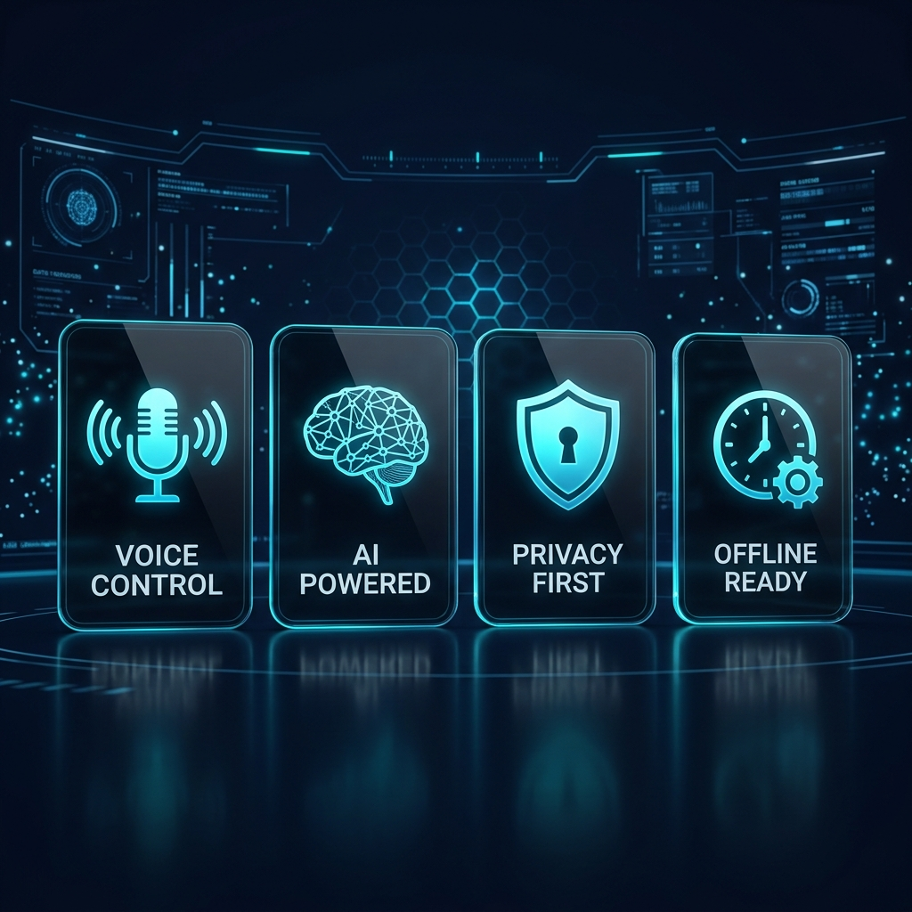
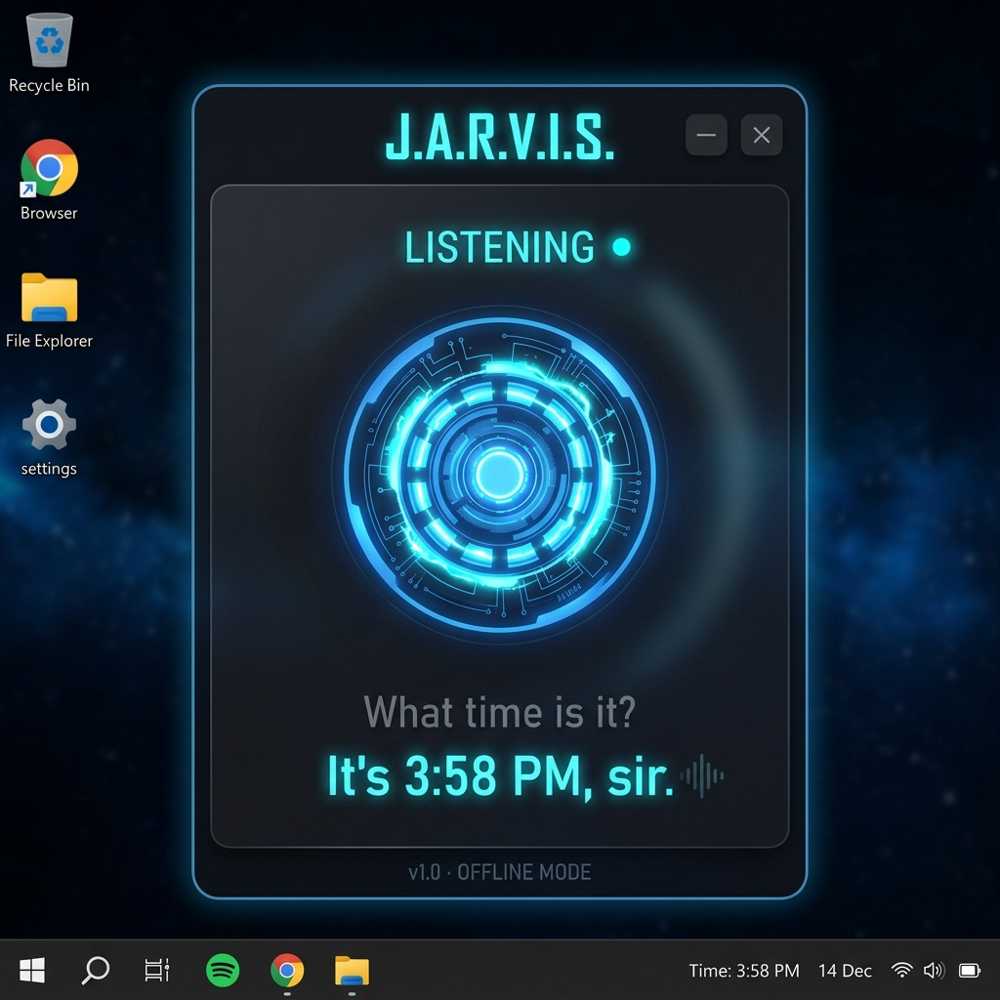

<p align="center">
  
</p>

<h1 align="center">🔵 J.A.R.V.I.S.</h1>

<h3 align="center">Just A Rather Very Intelligent System</h3>

<p align="center">
  <em>A local Windows desktop AI assistant inspired by Tony Stark's AI</em>
</p>

<p align="center">
  
  
  
  
  
  
</p>

---

<p align="center">
  
</p>

## ⚡ Quick Start

### 1. Run Setup (installs everything)
```bash
python setup.py
```

### 2. (Optional) Set Gemini API Key
```bash
# Create a .env file in the project root
echo GEMINI_API_KEY=your-api-key-here > .env
```
> Get a free API key from [Google AI Studio](https://aistudio.google.com/apikey)

### 3. Launch JARVIS
```bash
python main.py
```

---

## 🖥️ Interface

<p align="center">
  
</p>

<p align="center"><em>Floating glassmorphism HUD with arc reactor animation</em></p>

---

## 🔘 Wake Words

| Say This | JARVIS Responds |
|---|---|
| **"Hey JARVIS"** | "Yes sir, I'm listening." |
| **"JARVIS, are you there?"** | "Online and ready, sir. How can I assist?" |
| **"Daddy's home"** | *Dramatic HUD bootup animation* + "Welcome back, sir." |

### Sleep Commands
- "JARVIS, standby"
- "That'll be all, JARVIS"
- Auto-sleeps after 30 seconds of inactivity

---

## 🤖 What JARVIS Can Do

| Command | Example | Offline |
|---|---|:---:|
| 🕐 **Time & Date** | "What time is it?", "What's today's date?" | ✅ |
| 📂 **Open Apps** | "Open Chrome", "Launch Spotify", "Open VS Code" | ✅ |
| ❌ **Close Apps** | "Close Notepad", "Kill Chrome" | ✅ |
| 🔍 **Web Search** | "Search for the weather in Noida" | ✅ |
| 📊 **System Info** | "How much RAM is being used?", "CPU load?" | ✅ |
| 🎵 **Play Music** | "Play some music" | ✅ |
| ⏰ **Reminders** | "Remind me in 10 minutes to drink water" | ✅ |
| 💬 **Small Talk** | "Tell me a joke", "How are you?" | ✅ |
| 🧠 **AI Q&A** | Any question → routes to Gemini API | ❌ |

---

## 🎨 UI Features

- **Floating HUD** — Always-on-top dark glass widget in the corner
- **Arc Reactor** — Pulsing animation that glows brighter when listening
- **Status Indicators** — Standby (dim) / Listening (cyan) / Processing (amber) / Speaking (green)
- **Draggable** — Click and drag to reposition
- **System Tray** — Minimize to tray, double-click to restore
- **Compact Mode** — Minimizes to a small floating pill

---

## ⚙️ Tech Stack

| Component | Technology |
|---|---|
| 🖼️ UI | PyQt6 (floating glassmorphism HUD) |
| 🎤 STT | OpenAI Whisper (offline, `small` model) |
| 🔊 TTS Primary | Coqui TTS — `tts_models/en/vctk/vits` speaker `p267` |
| 🔊 TTS Fallback | edge-tts — `en-GB-RyanNeural` |
| 📊 System Stats | psutil |
| 🧠 AI Q&A | Google Gemini API (`google-genai` SDK) |
| 🔈 Audio | PyAudio + pygame |

---

## 📁 Project Structure

```
JARVIS/
├── main.py              # Entry point & orchestrator
├── config.py            # All configuration
├── setup.py             # One-click installer
├── requirements.txt     # Dependencies
├── .env                 # API keys (not tracked)
├── core/
│   ├── listener.py      # PyAudio + Whisper STT
│   ├── speaker.py       # Coqui/edge-tts
│   ├── wake_word.py     # Wake word detection (fuzzy)
│   └── command_router.py # Intent routing
├── skills/
│   ├── time_date.py     # Time & date
│   ├── app_control.py   # Open/close apps
│   ├── system_info.py   # CPU, RAM, battery
│   ├── web_search.py    # Google search
│   ├── media.py         # Music playback
│   ├── reminders.py     # Timed reminders
│   ├── small_talk.py    # Jokes & banter
│   └── gemini_ai.py     # Gemini AI fallback
├── ui/
│   ├── hud_widget.py    # Main floating HUD
│   ├── animations.py    # Arc reactor + bootup
│   ├── styles.py        # QSS dark theme
│   └── system_tray.py   # Tray icon
└── assets/
    ├── screenshots/     # README images
    ├── sounds/          # Startup sounds
    ├── icons/           # App icons
    └── fonts/           # Custom fonts
```

---

## 🔧 Key Technical Details

### Audio Pipeline
The listener uses **direct PyAudio recording** (not `speech_recognition`) for reliable capture on quiet laptop mics:
1. **Raw audio capture** at 16kHz via PyAudio
2. **RMS-based VAD** with auto-tuned threshold from ambient noise measurement
3. **Audio normalization** — amplifies quiet laptop mic audio (up to 50x gain) to target peak of 0.7
4. **Whisper `small` model** transcription with biased initial prompt for wake word accuracy

### TTS Feedback Prevention
The listener is paused during TTS playback and only resumes after audio finishes + 300ms buffer, preventing the mic from picking up JARVIS's own voice.

---

## 🔒 Privacy

- **Offline by default** — Voice recognition (Whisper) runs entirely locally
- **Only Gemini API needs internet** — and that's optional
- **No data sent anywhere** — everything stays on your machine
- **API key stays local** — `.env` file is excluded from git

---

## 📜 License

This project is open source and available under the [MIT License](LICENSE).

---

<p align="center">
  <em>"Sometimes you gotta run before you can walk."</em> — Tony Stark
</p>
